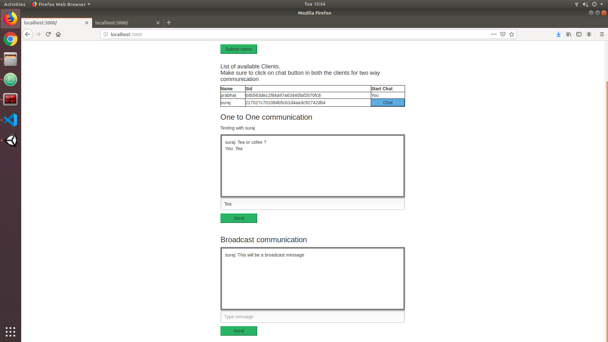

# SocketIO in `Flask` and `Javascript`

Creating a chat app which provides both `personal` and `group chat` option using Flask SocketIO and also dislplaying the
details of available clients inside a table.

Sid in flask can be used inside emit method to identify any client.Thus when parameter room=request.sid is passed inside the emit
function, the message is only sent to the particular client.

*Note*: Client can only send data to Server and not to anyother client socketIO.

## Developers Guideline
Type the following command based on your system to create the virtual enviornment in python.

```bash

#installing virutal environment

#for ubantu
python3 -m pip install --user virtualenv
#for windows
py -m pip install --user virtualenv

#creating instance of virtualenv
virtualenv venv

#activate virtualenv ubantu
source venv/bin/activate

#activate virtualenv ubantu
venv\Scripts\activate

#add the requirements
pip install -r requirements.txt

#running the project
python app.py

#or
flask run
```

*Note*: Please click Chat button in the `Table of available clients` for both the clients for two way communication for One to
One or private chat. The text at the bottom of the table will change. 

## Results
Displaying the messages for `first` client



Displaying the messages for `second` client


